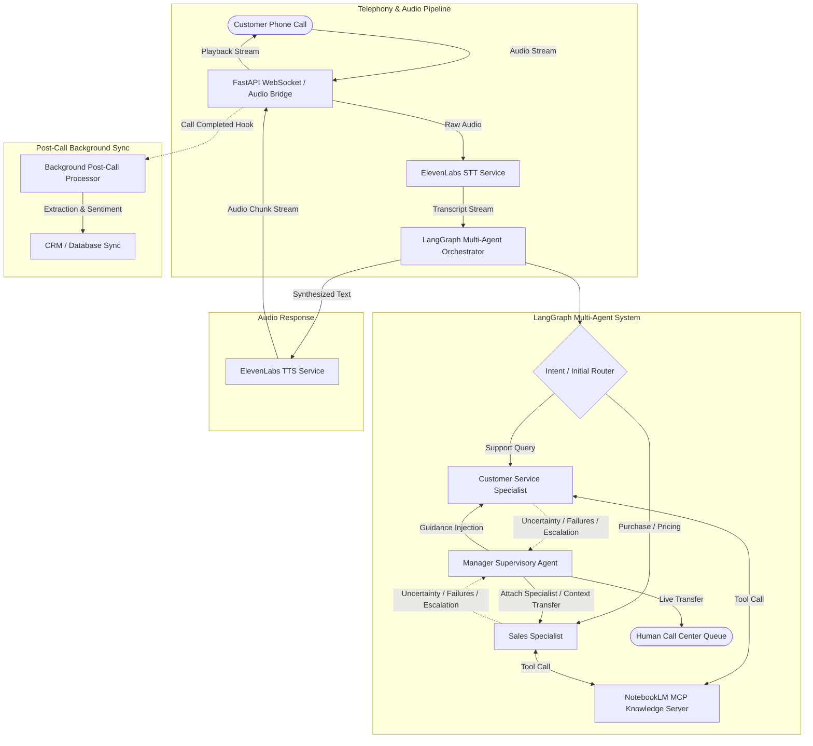

# Voice AI Customer Service & Sales Platform (POC)

A production-oriented Proof-of-Concept (POC) for a voice-first AI customer service and sales system designed to handle inbound customer phone calls, automate routine queries, ground factual responses on company documentation, and escalate intelligently to human operators.

---

## 1. System Architecture



---

## 2. Core Design Principles

1. **Pluggable & Decoupled Interfaces**: Every core integration (STT, TTS, Knowledge, CRM) implements an abstract interface in `app/interfaces/`. Any provider can be replaced with zero modifications to agent logic or telephony endpoints.
2. **Specialized ElevenLabs Role**: ElevenLabs is used **strictly for Speech-to-Text (STT) and Text-to-Speech (TTS)**. ElevenLabs' built-in Agent/Brain feature is intentionally not used, preserving full orchestration control in Python/LangGraph.
3. **Current Knowledge Provider**: Uses the **NotebookLM MCP** server to ground answers on uploaded company documents and extract citations.
4. **Supervisory Manager Pattern**: The Manager agent is **not invoked on every conversational turn**. Specialists operate autonomously and escalate to the Manager only when:
   - The agent does not know the answer.
   - Knowledge retrieval fails or is insufficient.
   - The agent is uncertain or ungrounded.
   - The customer is frustrated or dissatisfied.
   - The wrong specialist was routed.
   - Repeated failures occur (>= 3 turns).
   - Human operator intervention is explicitly requested.

---

## 3. Directory Layout

```
voice_ai_platform/
├── README.md                      # Architecture & Developer Documentation
├── pyproject.toml                 # Dependencies & project metadata
├── .env.example                   # Environment variable template
├── config/
│   ├── __init__.py
│   └── settings.py                # Type-safe Pydantic Settings
├── app/
│   ├── __init__.py
│   ├── main.py                    # FastAPI application & lifespan management
│   ├── api/
│   │   ├── dependencies.py        # Dependency injection providers
│   │   └── v1/
│   │       ├── health.py          # Liveness & readiness probes
│   │       ├── calls.py           # Call session management endpoints
│   │       └── audio.py           # Real-time full-duplex WebSocket stream
│   ├── core/
│   │   ├── exceptions.py          # Domain exception hierarchy
│   │   └── logging.py             # Structured logging configuration
│   ├── schemas/
│   │   ├── call.py                # Call sessions, audio chunks, transcripts
│   │   ├── agent.py               # Decisions, escalation reasons, turns
│   │   └── crm.py                 # Structured post-call summaries & profiles
│   ├── interfaces/
│   │   ├── stt.py                 # BaseSTTService interface
│   │   ├── tts.py                 # BaseTTSService interface
│   │   ├── knowledge.py           # BaseKnowledgeService interface
│   │   └── crm.py                 # BaseCRMService interface
│   ├── services/
│   │   ├── audio/
│   │   │   ├── elevenlabs_stt.py  # ElevenLabs STT skeleton
│   │   │   └── elevenlabs_tts.py  # ElevenLabs TTS skeleton
│   │   ├── knowledge/
│   │   │   └── notebooklm_mcp.py  # NotebookLM MCP client adapter
│   │   ├── crm/
│   │   │   └── local_crm.py       # PostgreSQL / Local CRM skeleton
│   │   └── post_call/
│   │       └── processor.py       # Background transcript analysis & CRM sync
│   ├── agents/
│   │   ├── state.py               # LangGraph CallAgentState TypedDict
│   │   ├── graph.py               # LangGraph compiled StateGraph
│   │   ├── manager.py             # Manager supervisory agent logic
│   │   ├── service.py             # Customer Service specialist agent
│   │   └── sales.py               # Sales specialist agent
│   └── db/
│       ├── session.py             # Async SQLAlchemy engine & session factory
│       └── models/
│           ├── call.py            # CallRecord & TranscriptRecord ORM models
│           └── customer.py        # CustomerRecord ORM model
└── tests/
    ├── conftest.py                # Shared pytest fixtures
    └── unit/
        ├── test_interfaces.py     # Protocol compliance checks
        └── test_agent_state.py    # Graph compilation & routing checks
```

---

## 4. Setup & Local Development

### Prerequisites
- Python 3.11+
- Node.js 18+ (for NotebookLM MCP client)
- PostgreSQL (optional for local SQLite testing, required for pgvector RAG later)

### Installation
```bash
# Navigate to project directory
cd voice_ai_platform

# Create virtual environment
python -m venv .venv
source .venv/bin/activate  # On Windows: .venv\Scripts\activate

# Install dependencies
pip install -e ".[dev]"

# Copy environment template
cp .env.example .env
```

### Running the API Server
```bash
uvicorn app.main:app --reload --host 0.0.0.0 --port 8000
```
- API Docs: `http://localhost:8000/docs`
- Health Check: `http://localhost:8000/api/v1/health/`
- Readiness Check: `http://localhost:8000/api/v1/health/ready`

---

## 5. Voice Agent Integration (ElevenLabs Speech Engine)

The platform includes real-time bidirectional conversational voice powered by **ElevenLabs Speech Engine** (acting strictly as the voice layer: STT, TTS, turn-taking, and barge-in / interruption handling) while retaining Python, Groq, and Local Knowledge as the conversational brain.

### Development Startup Sequence:
1. **Start ngrok tunnel**:
   ```bash
   ngrok http 8000
   ```
2. **Start FastAPI application**:
   ```bash
   python -m uvicorn app.main:app --host 0.0.0.0 --port 8000 --reload
   ```
3. **Configure Speech Engine**:
   ```bash
   python scripts/setup_elevenlabs.py
   ```
4. **Open Browser Voice UI**:
   Navigate to `http://localhost:8000/voice`:
   - Select department (**Sales** or **Customer Support**).
   - Click **Start Call**.
   - Speak naturally with Sarah or Alex, and interrupt mid-response.

### Running Voice Tests:
```bash
pytest tests/unit/test_voice_service.py -v
```

---

## 6. Component Replacement Guide

| Component | Current Implementation | Interface | Alternative Replacements |
| :--- | :--- | :--- | :--- |
| **Voice Layer** | `ElevenLabs Speech Engine` | `SpeechEngineResource` | Deepgram + Cartesia, LiveKit |
| **Conversational LLM** | `Groq (openai/gpt-oss-20b)` | `GeminiClient` | Google Gemini, OpenAI GPT-4o |
| **Runtime Knowledge** | `LocalKnowledgeProvider` | `BaseKnowledgeProvider` | pgvector Hybrid Search, Pinecone, Qdrant |
| **Upstream Knowledge** | `NotebookLM MCP` | `BaseKnowledgeProvider` | Document Ingestion Pipeline |
| **CRM Sync** | `LocalCRMService` | `BaseCRMService` | HubSpot, Salesforce, Zoho CRM |

