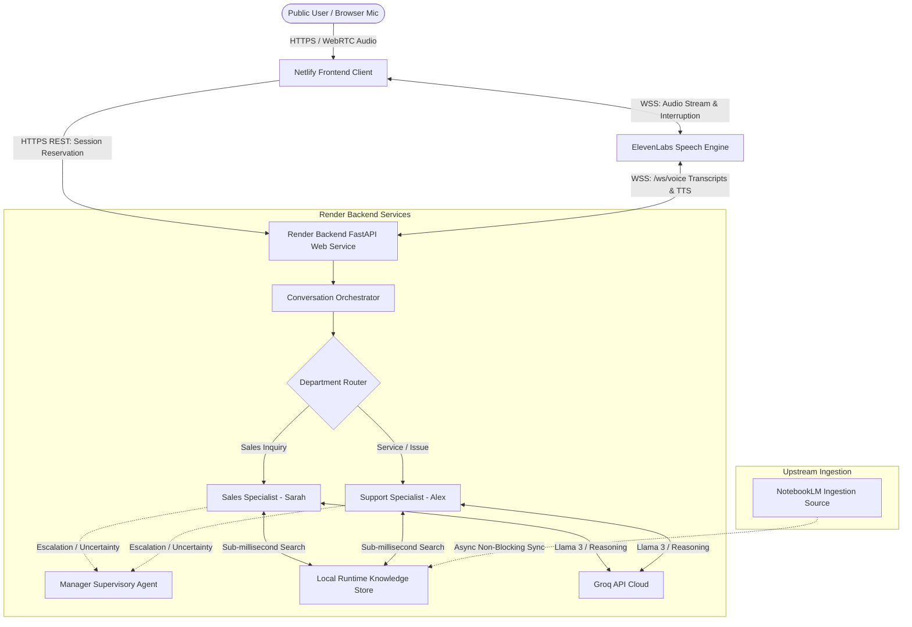

# Coway Voice AI Customer Service & Sales Platform (POC)

A production-ready Proof-of-Concept (POC) for a voice-first AI customer service and sales system designed to handle inbound customer calls, automate routine queries, ground factual responses on company documentation, and escalate intelligently between specialists.

---

## 1. System Architecture



---

## 2. Core Architectural Guarantees

1. **Zero Latency in Live Calls**: Customer calls **NEVER query NotebookLM synchronously**. All product specs, prices, discounts, and troubleshooting steps are retrieved in `< 1ms` from an in-memory, version-controlled `LocalRuntimeKnowledgeStore`.
2. **Specialized Voice Layer**: **ElevenLabs Speech Engine** handles STT, TTS, turn-taking, and barge-in / interruption detection. The conversational reasoning, knowledge retrieval, and agent logic remain completely in our backend.
3. **Decoupled Deployment**:
   - **Frontend**: Hosted on **Netlify** (Static ESM Web App with HTTPS microphone permissions).
   - **Backend**: Hosted on **Render** (Production ASGI FastAPI service with persistent WebSocket endpoint `/ws/voice`).
4. **Complete Secret Isolation**:
   - Frontend JavaScript contains **ZERO** API keys or secrets.
   - `GROQ_API_KEY`, `ELEVENLABS_API_KEY`, and `ELEVENLABS_SPEECH_ENGINE_ID` reside strictly server-side on Render.

---

## 3. Directory Layout

```
voice_ai_platform/
├── README.md                      # Architecture, deployment & operations guide
├── render.yaml                    # Render blueprint for backend service
├── netlify.toml                   # Netlify configuration & security headers
├── pyproject.toml                 # Package definition & dependencies
├── requirements.txt               # Production Python dependencies for Render
├── .env.example                   # Non-secret environment configuration template
├── frontend/                      # Standalone Netlify frontend application
│   ├── index.html                 # Voice AI web client UI
│   └── config.js                  # Frontend runtime backend URL configuration
├── config/
│   ├── __init__.py
│   └── settings.py                # Type-safe Pydantic Settings & CORS resolver
├── app/
│   ├── main.py                    # FastAPI entrypoint, CORS, /health, and /status
│   ├── agents/                    # SalesAgent (Sarah), SupportAgent (Alex), Manager
│   ├── conversation/              # Conversation state machine & history
│   ├── knowledge/                 # Local Runtime Store & Snapshot Versioning
│   ├── llm/                       # Groq (primary) and Gemini (fallback) clients
│   └── voice/                     # ElevenLabs Speech Engine router (/ws/voice)
├── data/
│   └── knowledge_snapshots/       # Versioned runtime snapshots (manifest.json, v1.json)
├── scripts/
│   ├── chat.py                    # Interactive CLI simulator (supports --debug)
│   ├── setup_elevenlabs.py        # ElevenLabs Speech Engine provisioner & updater
│   └── benchmark_latencies.py     # Turn latency benchmark runner
└── tests/
    └── unit/                      # Pytest test suite (39 unit tests)
```

---

## 4. Local Development

### 1. Install Dependencies
```bash
# In your virtual environment (Python 3.11 or 3.12)
pip install -r requirements.txt
```

### 2. Configure Environment Variables
Copy `.env.example` to `.env` and fill in your keys:
```bash
cp .env.example .env
```
Ensure your `.env` contains:
```env
APP_ENV=development
APP_DEBUG=true
LLM_PROVIDER=groq
LLM_MODEL=openai/gpt-oss-20b
GROQ_API_KEY=gsk_your_groq_api_key
ELEVENLABS_API_KEY=your_elevenlabs_api_key
ELEVENLABS_SPEECH_ENGINE_ID=your_speech_engine_id
KNOWLEDGE_PROVIDER=local
```

### 3. Run the CLI Chat Interface
Test agent reasoning and local knowledge retrieval instantly in the terminal:
```bash
# Standard conversational mode
python scripts/chat.py

# Telemetry debug mode (displays Groq timing & local knowledge retrieval)
python scripts/chat.py --debug
```

### 4. Run the Local Voice Service (with ngrok)
To test browser voice streaming locally:
```bash
# Terminal 1: Start ngrok tunnel for ElevenLabs WebSocket callback
ngrok http 8000

# Terminal 2: Start FastAPI backend
python -m uvicorn app.main:app --host 0.0.0.0 --port 8000 --reload

# Terminal 3: Point ElevenLabs Speech Engine to your ngrok URL
python scripts/setup_elevenlabs.py
```
Open `http://localhost:8000` or `http://localhost:8000/voice` to speak with Sarah or Alex.

---

## 5. Render Backend Deployment

Deploy the FastAPI service on Render as a long-running Web Service with WebSocket support.

### Option A: Deploy via Blueprint (`render.yaml`)
1. Push your repository to GitHub.
2. In the Render Dashboard, click **New +** > **Blueprint**.
3. Select your repository `Voice-Ai-Agent`.
4. Render will parse `render.yaml` and configure the web service automatically.

### Option B: Manual Web Service Setup
1. In Render Dashboard, click **New +** > **Web Service**.
2. Connect your GitHub repository: `https://github.com/Vivan-23/Voice-Ai-Agent`.
3. Configure the service settings:
   - **Name**: `coway-ai-backend`
   - **Environment**: `Python 3`
   - **Region**: Closest to your users (e.g., Singapore, Frankfurt, or Oregon)
   - **Branch**: `main`
   - **Build Command**: `pip install -r requirements.txt`
   - **Start Command**: `uvicorn app.main:app --host 0.0.0.0 --port $PORT`
   - **Health Check Path**: `/health`

### Render Environment Variables
Add the following variables in the **Environment** tab:

| Variable | Value | Description |
| :--- | :--- | :--- |
| `GROQ_API_KEY` | `gsk_...` | Groq API Key (Secret) |
| `ELEVENLABS_API_KEY` | `xi_...` | ElevenLabs API Key (Secret) |
| `ELEVENLABS_SPEECH_ENGINE_ID` | `seng_...` | Speech Engine Resource ID |
| `ELEVENLABS_PUBLIC_WS_URL` | `wss://<service>.onrender.com/ws/voice` | Render WebSocket endpoint |
| `LLM_PROVIDER` | `groq` | Primary LLM engine |
| `LLM_MODEL` | `openai/gpt-oss-20b` | High-speed conversational model |
| `KNOWLEDGE_PROVIDER` | `local` | Active runtime snapshot mode |
| `CORS_ALLOWED_ORIGINS` | `https://<site>.netlify.app` | Allowed Netlify origin |
| `FRONTEND_ORIGIN` | `https://<site>.netlify.app` | Production frontend URL |
| `APP_ENV` | `production` | Production environment flag |
| `APP_DEBUG` | `false` | Disable verbose development debug logs |

### Verify Backend Deployment
Once Render deploys your service (e.g., `https://coway-ai-backend.onrender.com`):
```bash
# 1. Check health
curl https://coway-ai-backend.onrender.com/health
# Response: {"status":"ok","service":"voice_ai_platform_poc"}

# 2. Check runtime status (non-secret diagnostic)
curl https://coway-ai-backend.onrender.com/status
```

---

## 6. Configure ElevenLabs Speech Engine for Render

Once your Render backend is deployed and reachable at `https://<your-service>.onrender.com`, update your Speech Engine to point its WebSocket to Render:

```bash
python scripts/setup_elevenlabs.py --ws-url wss://<your-service>.onrender.com/ws/voice
```
Or update the Speech Engine target directly in the **ElevenLabs Conversational AI Dashboard** to:
`wss://<your-service>.onrender.com/ws/voice`

---

## 7. Netlify Frontend Deployment

Deploy the browser voice interface to Netlify.

### Step 1: Connect Repository to Netlify
1. Log in to [Netlify](https://app.netlify.com/).
2. Click **Add new site** > **Import an existing project** > **GitHub**.
3. Select repository: `Voice-Ai-Agent`.
4. Configure Build settings:
   - **Base directory**: Leave blank (root).
   - **Build command**: Leave blank (or `echo "Frontend ready"`).
   - **Publish directory**: `frontend`
5. Click **Deploy Site**.

### Step 2: Configure Render Backend URL
You can connect the Netlify frontend to your Render backend in either of two ways:

1. **In `frontend/config.js`**:
   Set `BACKEND_URL`:
   ```javascript
   window.COWAY_CONFIG = {
     BACKEND_URL: "https://<your-service>.onrender.com"
   };
   ```
2. **In Browser (Zero-redeploy)**:
   - Append `?api=https://<your-service>.onrender.com` to your Netlify site URL.
   - Or click the **Change** button in the top status bar of the web app to save your Render URL.

---

## 8. Public Verification & Test Procedures

### Test 1: Sales Specialist (Sarah)
1. Open the public Netlify URL on desktop or mobile over HTTPS.
2. Select **Sales** (Sarah).
3. Click **Start Call** and grant microphone permission.
4. Verify initial spoken greeting: *"Hello! Welcome to Coway India. My name is Sarah..."*
5. Speak: *"What products do you sell?"*
6. Speak: *"What about the Airmega 150?"*
7. Speak: *"What discounts do you have right now?"*
8. **Test Interruption**: While Sarah is reading the discount details, interrupt naturally: *"Wait, what about the Airmega 250?"*
9. Verify that playback stops immediately and Sarah seamlessly transitions to the Airmega 250 specs.

### Test 2: Customer Support Specialist (Alex)
1. End call or refresh the page.
2. Select **Customer Support** (Alex).
3. Click **Start Call**.
4. Verify greeting: *"Hello! Thank you for calling Coway Customer Support. My name is Alex..."*
5. Speak: *"I have an Airmega 150 and it's not turning on."*
6. Verify troubleshooting guidance grounded on the `AP-1019C` power outlet and cartridge pre-filter latch checks.

---

## 9. POC Architecture Limitations

This system is an optimized Proof-of-Concept demonstration. The following explicit constraints apply:

1. **Render Free Tier Cold Starts**: On Render's free tier, the web service automatically spins down after 15 minutes of inactivity. The first request after idle may take 30–50 seconds while the container initializes. Subsequent calls are instant.
2. **Single-Instance In-Memory Session Store**: Call session mappings and turn histories are held in-memory. In a distributed multi-instance deployment, an external shared cache (such as Redis) would be introduced.
3. **Browser Microphone Permission**: WebRTC / ElevenLabs voice audio requires explicit microphone permissions and an HTTPS origin (provided automatically by Netlify).
4. **Knowledge Synchronization**: NotebookLM synchronization occurs upstream/out-of-band via background worker tasks. The production call path strictly reads static, immutable snapshots for deterministic latency.
